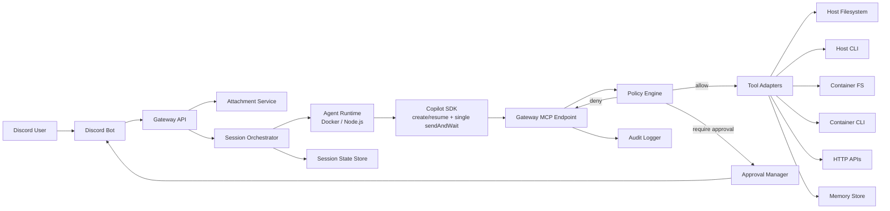
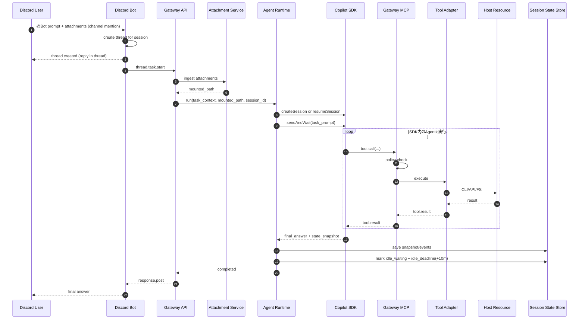
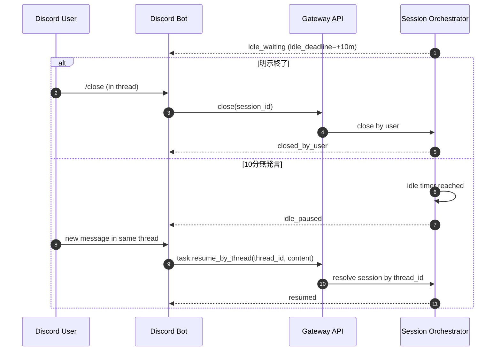
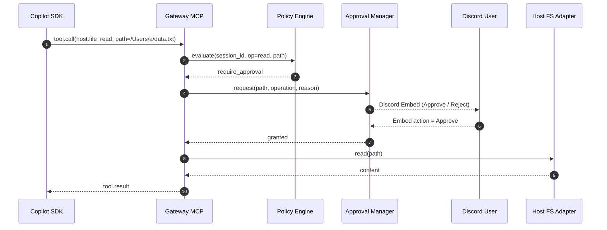

# 個人用 AI エージェント設計ドキュメント（GitHub Copilot SDK + Gateway + Discord）

## 1. 目的

Discord から投入された単一タスクを、Copilot の Agentic な振る舞いで実行する。  
制約は以下:

- **外部 MCP サーバーは利用しない**
- **すべてのツール実行は Gateway 経由**
- **1タスクの本体実行は `sendAndWait` を1回（`create/resume` は別途）**
- **ホスト上のファイル/CLI操作は常に明示承認**
- **Agent コンテナ内のファイル操作・CLI実行（Python 等）は承認不要で許可**
- **セッションは `/close` で明示終了、10分無発言で自動停止し次発言で再開**
- **セッション再開可能な状態保存**
- **永続 Memory をツールとして提供**

> ここでの「Gateway の分割」は論理分割。MVP では 1 Node.js プロセス内モジュール構成でよい。

---

## 2. 全体アーキテクチャ



### 論理コンポーネント責務

| コンポーネント | 主責務 |
|---|---|
| Discord Bot | チャンネルメンション受付、スレッド作成、スレッド内コマンド、承認 Embed UI、結果通知 |
| Gateway API | タスク受付、セッション制御、Agent 起動/停止 |
| Attachment Service | 添付受信、検証、Agent コンテナへの配置 |
| Session Orchestrator | 実行状態管理、再開制御、状態保存 |
| Agent Runtime | Copilot SDK セッション確立（create/resume）と sendAndWait 実行、結果返却 |
| Gateway MCP Endpoint | SDK からの tool call 受口 |
| Policy Engine | allow / require_approval / deny 判定 |
| Approval Manager | ユーザー承認要求、応答反映、タイムアウト |
| Tool Adapters | Container CLI/FS、Host CLI/API/FS、Memory への実行変換 |
| Session State Store | セッション継続情報、復元スナップショット保存 |
| Audit Logger | 判定根拠含む監査証跡保存 |

---

## 3. 実行フロー（通常系・`sendAndWait` 1回実行）



---

## 3.1 セッション継続・自動停止・再開フロー

`sendAndWait` 完了後もセッションはスレッドに紐づいて維持される。  
ライフサイクルは次の通り:

1. スレッド内で `/close` 実行時に `closed_by_user` で終了  
2. スレッド内のユーザー発言が 10 分ない場合は `idle_paused` へ自動停止  
3. `idle_paused` 後に同一スレッドでユーザー発言があれば `resumeSession + sendAndWait` で自動再開



---

## 4. 実行フロー（ホストファイル承認）

ホスト上のファイル操作は **read/write/delete/list すべて承認必須**。  
承認は「セッション単位 + パス単位（ファイル/ディレクトリ）」で記録し、未承認パスはエラーにする。



### 未承認パス時の挙動

- エラーコード: `path_not_approved_for_session`
- SDK へ理由付き返却
- Agent は代替案（承認依頼、別手段、説明）を生成

---

## 5. 添付ファイル取扱い

- Discord 添付は受信後、Gateway が検証し Agent コンテナへ転送する
- セッション専用パス例: `/agent/session/<session_id>/attachments`
- 添付領域内は LM が自由に読み書き可能
- `container.cli_exec` により、添付や作業領域を Python などの CLI で自由に解析可能
- 添付更新内容は必要に応じて成果物として Discord へ返送可能

---

## 6. 拒否系フロー

以下は即時 `deny`:

- 外部 MCP 参照 (`external_mcp_disabled`)
- 未承認パスアクセス (`path_not_approved_for_session`)
- コンテナ領域外アクセス (`container_path_out_of_scope`)
- 禁止コマンド実行 (`policy_denied_command`)

Agent には「できない理由 + 代替案」を返し、ユーザーに明示通知する。

---

## 7. メッセージ契約（最小）

### 7.1 Discord -> Gateway (`thread.task.start`)

```json
{
  "event": "mention_start",
  "task_id": "tsk_20260316_001",
  "session_id": "ses_001",
  "channel_id": "chn_001",
  "thread_id": "thr_001",
  "source_message_id": "msg_001",
  "user_id": "discord_user_123",
  "content": "添付CSVを分析して要点をまとめて",
  "attachments": [
    {"attachment_id": "att_1", "filename": "sales.csv", "size": 120304}
  ],
  "timestamp": "2026-03-16T17:00:00Z"
}
```

### 7.2 Gateway -> Agent (`agent.run`)

```json
{
  "task_id": "tsk_20260316_001",
  "session_id": "ses_001",
  "sdk_execution_mode": "single_send_and_wait",
  "session_bootstrap_mode": "create_or_resume",
  "session_lifecycle_policy": {
    "explicit_close_command": "/close",
    "idle_timeout_sec": 600,
    "on_idle_timeout": "idle_pause",
    "resume_trigger": "thread_user_message"
  },
  "thread_context": {"channel_id": "chn_001", "thread_id": "thr_001"},
  "attachment_mount_path": "/agent/session/ses_001/attachments",
  "runtime_policy": {
    "tool_routing": {
      "mode": "gateway_only",
      "allow_external_mcp": false
    }
  }
}
```

### 7.3 SDK -> Gateway MCP (`tool.call`)

```json
{
  "task_id": "tsk_20260316_001",
  "session_id": "ses_001",
  "call_id": "toolcall_01",
  "tool_name": "host.file_read",
  "execution_target": "gateway_adapter",
  "arguments": {
    "path": "/Users/example/Documents/report.md"
  },
  "reason": "要約対象の確認"
}
```

### 7.4 Gateway MCP -> SDK (`tool.result` error)

```json
{
  "task_id": "tsk_20260316_001",
  "call_id": "toolcall_01",
  "status": "error",
  "error_code": "path_not_approved_for_session",
  "message": "Path is not approved in this session. Request approval first."
}
```

---

## 8. Policy Engine 設計

### 8.1 判定結果

- `allow`
- `require_approval`
- `deny`

### 8.2 判定軸

- 実行経路（`gateway_adapter` 固定か）
- ツール種別（fs/http/cli/memory）
- 操作（read/write/delete/list/exec）
- パス承認状態（セッション単位）
- コマンド allowlist / denylist
- ユーザー・チャンネル文脈

### 8.3 サンプルポリシー（YAML）

```yaml
tool_routing:
  mode: gateway_only
  allow_external_mcp: false

attachments:
  container_path_template: "/agent/session/{session_id}/attachments"
  decision: allow

container_files:
  root_path_template: "/agent/session/{session_id}"
  read: { decision: allow }
  write: { decision: allow }
  delete: { decision: allow }
  list: { decision: allow }

container_cli:
  decision: allow
  execution_scope: agent_container_only
  working_dir_template: "/agent/session/{session_id}"
  examples: [python, python3, node, bash]

host_files:
  read: { decision: require_approval }
  write: { decision: require_approval }
  delete: { decision: require_approval }
  list: { decision: require_approval }
  approval_scope: session_path_allowlist

host_cli:
  decision: require_approval
  allowed_commands: [git, node, npm, yarn, curl]

network:
  web_search: { decision: allow }
  http_request: { decision: require_approval }

memory:
  read: { decision: allow }
  write: { decision: allow }

external_mcp:
  decision: deny
```

---

## 9. セッション再開設計（State Persistence）

### 方針

- Copilot SDK 側に復元 API がある場合はそれを利用
- ない場合でもアプリ側で復元可能な状態を保存する

### 保存対象

- 入力プロンプト
- SDK 出力（最終回答/中間イベント）
- tool call / result 履歴
- 承認履歴
- セッション要約（再開時の短縮コンテキスト）

### 再開手順

1. `session_id` 指定で状態ロード  
2. 未完了タスクを再接続  
3. `resumeSession` 後に必要なタスク本体を `sendAndWait` で実行

---

## 10. 永続 Memory ツール設計

提供ツール（Gateway 内蔵）:

- `memory.upsert`
- `memory.search`
- `memory.get`
- `memory.delete`

設計ポイント:

- `user_id` + `namespace` で分離
- セッションを跨いで保持
- 監査ログ対象（読み書きともに）
- 将来のベクトル検索に拡張可能

---

## 11. Discord インターフェース（メンション + スレッドコマンド）

| コマンド | 目的 | 主な引数 |
|---|---|---|
| `@Bot <prompt>`（チャンネル） | セッション開始 + スレッド作成 | `prompt`, `attachments` |
| `/status`（スレッド内） | 対応セッションの進捗確認 | なし |
| `/cancel`（スレッド内） | 対応セッションの実行中タスク停止 | なし |
| `/close`（スレッド内） | 対応セッションを明示終了 | なし |
| `/list` | 自分のセッション一覧 | なし |

補足:

- `/status` `/cancel` `/close` はセッションスレッド内でのみ受け付ける
- スレッド内のユーザー発言が 10 分ない場合は `idle_paused` に自動遷移する
- `idle_paused` セッションは同一スレッドでの次発言で自動再開する
- 承認操作は Slash Command ではなく Discord Embed 入力（Approve/Reject）で行う

---

## 12. データ永続化（最小）

- `sessions(session_id, user_id, channel_id, thread_id, status, last_thread_activity_at, idle_deadline_at, closed_reason, closed_at, created_at, updated_at)`
- `tasks(task_id, session_id, user_id, status, created_at, updated_at)`
- `task_events(event_id, task_id, event_type, payload_json, timestamp)`
- `approvals(approval_id, task_id, session_id, action, path, status, requested_at, responded_at, responder_id)`
- `session_path_permissions(session_id, path, operation, granted_by, granted_at, expires_at)`
- `session_snapshots(session_id, snapshot_json, created_at)`
- `memory_entries(memory_id, user_id, namespace, key, value_json, updated_at)`
- `audit_logs(log_id, correlation_id, actor, decision, reason, raw, timestamp)`

---

## 13. セキュリティチェックリスト

- 外部 MCP 接続設定は起動時に禁止検証
- `execution_target=gateway_adapter` 以外は拒否
- コンテナ内 CLI/FS は `agent_container_only` スコープに固定
- ホストファイル操作は常に承認確認
- 未承認パスは read でも拒否
- ホスト CLI は allowlist + 承認 + タイムアウト
- 承認ログ・拒否ログを必ず記録
- 機密値をマスキング

---

## 14. MVP 実装順

1. チャンネルで `@Bot` メンション受信 -> スレッド作成 -> Gateway -> Agent（`create/resume + sendAndWait`）
2. 添付ファイル転送とコンテナマウント
3. `container.file_*` / `container.cli_exec`（Python 含む）実装
4. `host.file_*` 全操作の承認フロー
5. `session_path_permissions` による未承認パス拒否
6. `/status` `/cancel` `/close`（スレッド内）と `/list`
7. 10分アイドルで `idle_paused`、同一スレッド発言で自動再開
8. `memory.*` ツール実装
9. セッションスナップショット保存と再開
10. 監査ログ整備

---

## 15. 完成イメージ

- ユーザーはチャンネルメンションで開始し、以降はセッションスレッドで操作
- Agent は `sendAndWait` 1回で Agentic に処理（前段で create/resume）
- ツール実行はすべて Gateway 管理下
- コンテナ内では Python を含む CLI でのファイル操作・解析を自由に実行可能
- ホストアクセスは常に明示承認 + セッション許可パスで制御
- セッションは `/close` で終了し、10分無発言時は `idle_paused` として停止後に自動再開できる
- セッション再開と永続 Memory により、長期的な作業継続が可能
